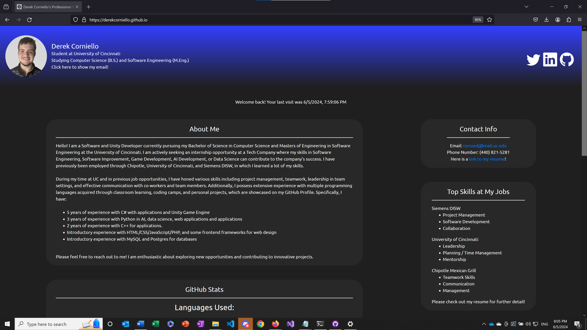
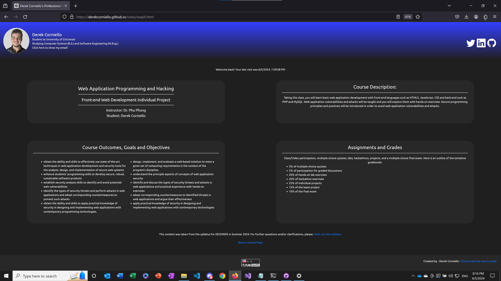
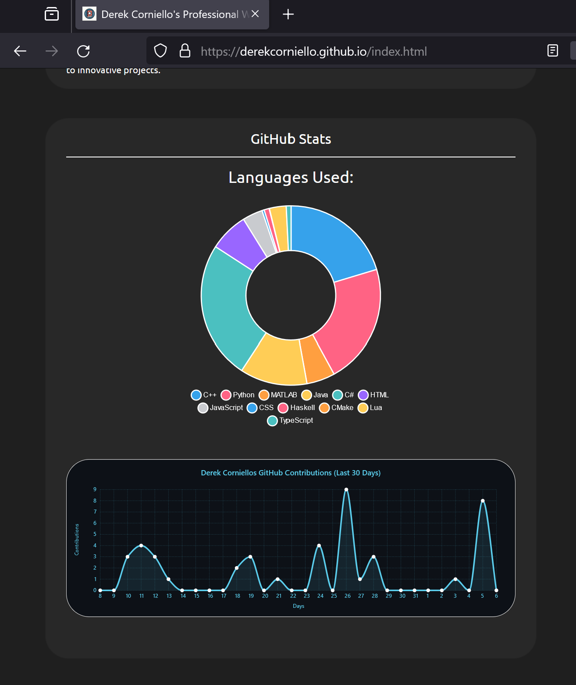
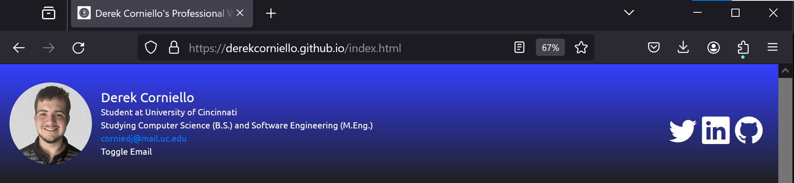

# WAPH-Web Application Programming and Hacking

## Instructor: Dr. Phu Phung

## Student

**Name**: Derek Corniello

**Email**: corniedj@mail.uc.edu

**Short-bio**: I am a second year CS student with experience in OOP languages and a love for game and app design. 
{width=100 height=150}

## Repository Information

Respository's URL: [https://github.com/DerekCorniello/waph-corniedj](https://github.com/DerekCorniello/waph-corniedj)

This is a private repository for Derek Corniello to store all code from the course and its activities. This directory contains the files for lab1.

## The project's overview

The general requirements:
    
    1. A professional website with names, resume, headshot, contact, and background/experience/skills.

    2. Create an HTML page that shows information about the WAPH course.

The non-technical requirements:

    1. Use an open source CSS template or framework

    2. Target the page for an employer

    3. Include a page tracker

The technical requirements:

    1. Use jQuery and another open source JavaScript library or framework

    2. Implement JavaScript code from [Lab 2](https://github.com/DerekCorniello/waph-corniedj/labs/lab2):

        * Digital and Analog Clock

        * Toggle Email

        * One other additional feature

    3. Integrate two public APIs:

        * [JokeAPI](https://v2.jokeapi.dev/joke/Any)

        * Another public API that returns a graphic

    4. Use JavaScript to remember the client using cookies, and display a different message depending on their cookies

Each section below will outline how the requirements were met, and include screenshots of the page that shows it.

This project helped pull all of the different concepts we have learned in the lab as well as some new concepts discovered while making this.

Link to the lab directory: [https://github.com/DerekCorniello/waph-corniedj/labs/lab2](https://github.com/DerekCorniello/waph-corniedj/labs/lab2).

Link to the webpage, hosted on GitHub.io: [https://derekcorniello.github.io/](https://derekcorniello.github.io/)


### General Requirements

The first requirement handles most of the professional part of the website. Here is the beginning of the website (See *Figure 2*):



...and the WAPH page in the second requirement is linked at the bottom, and shown in *Figure 3*:



### Non-Technical Requirements

My page uses [Bootstrap](https://getbootstrap.com/), an open source CSS framework, seen in these lines (*Figure 3*), which import a few of Bootstrap's assets and scripts:

```HTML
    <link href="https://stackpath.bootstrapcdn.com/bootstrap/4.5.2/css/bootstrap.min.css" rel="stylesheet">
    <!--Bootstrap CSS-->
    <link href="https://cdn.jsdelivr.net/npm/bootstrap-icons@1.7.2/font/bootstrap-icons.css" rel="stylesheet">
    <!--Bootsrap Icons-->
    <script src="https://cdn.jsdelivr.net/npm/bootstrap@4.0.0/dist/js/bootstrap.min.js" <!--Bootstrap JS-->
        integrity = "sha384-JZR6Spejh4U02d8jOt6vLEHfe/JQGiRRSQQxSfFWpi1MquVdAyjUar5+76PVCmYl" crossorigin = "anonymous" >
    </script>
```

As seen in *Figure 2*, the landing page also includes a page with all of my professional information, and the footer has the page tracker, using the [FlagCounter API](https://info.flagcounter.com/Guos):

```HTML
<a href="https://info.flagcounter.com/Guos"></a>
```

In addition to that, *Figure 4* shows the GitHub statistics of my profile:



### Technical Requirements

jQuery is used in conjunction with JavaScript to implement different messages depending on if it is your first time visiting the website or not. It is a little more lengthy, but it is comprehensive in the HTML:

```HTML
<script>
    function getCookie(name) {
        var nameEQ = name + "=";
        var cookies = document.cookie.split(';');
        for (var i = 0; i < cookies.length; i++) {
            var cookie = cookies[i];
            while (cookie.charAt(0) == ' ') {
                cookie = cookie.substring(1, cookie.length);
            }
            if (cookie.indexOf(nameEQ) == 0) {
                return cookie.substring(nameEQ.length, cookie.length);
            }
        }
        return null;
    }

    function setCookie(name, value, days) {
        var expires = "";
        if (days) {
            var date = new Date();
            date.setTime(date.getTime() + (days * 24 * 60 * 60 * 1000));
            expires = "; expires=" + date.toUTCString();
        }
        document.cookie = name + "=" + (value || "") + expires + "; path=/";
    }

    function displayWelcomeMessage() {
        var cookie = getCookie("lastVisitDC");
        var currentDate = new Date();
        var dateString = currentDate.toLocaleString();

        if (!cookie) {
            $("#welcome-message").text("Welcome to my homepage!");
        } else {
            var lastVisit = cookie;
            $("#welcome-message").text("Welcome back! Your last visit was " + lastVisit);
        }

        setCookie("lastVisitDC", dateString, 90);
    }

    // Call the function to display the welcome message
    displayWelcomeMessage();
</script>

```

To sum the code above, when the website is visited, it looks for a cookie called lastVisitDC. If the cookie doesn't exist (is nill), it will set the welcome message to show a new user welcome message. Otherwise, it will welcome you back and also give the last time you visited.

The features from Lab 2 that I implemented include the digital and analog clock (*Figure 5*), and toggling the email (*Figure 6*), and linking an outside URL in the comedy section / image resizing for the other features from the lab:




The website includes the random joke API, and it also has a few APIs that return images, but the main one is seen in *Figure 5*, with the meme in the comedy section. Here is the API call, using JavaScript and jQuery:

```JavaScript
function loadMemeSection() {
        // Fetch the random meme
        $.get("https://meme-api.com/gimme", function(result) {
            console.log("From Meme API: " + JSON.stringify(result));
            if (result.nsfw === false) {
                // Display the meme image and alt text
                $("#meme-img").attr("src", result.url).attr("alt", result.alt);
                $("#meme-title").text(`u/${result.author} posted in r/${result.subreddit}:`);
                $("#meme-title").attr("href", result.postLink);
                $("#meme-descr").text(result.title);
            } else {
                loadMemeSection();
            }
        });
    }
```

Finally, there were a few outside JavaScript frameworks used in this project:

    * Chart.js - used for the donut chart generation

    * Vue.js - used for structuring parts of the page, namely the GitHub stats card

    * Axios - used for HTTP requests

The source code is available in the footer, as seen in *Figure 5*, through the webpage!
